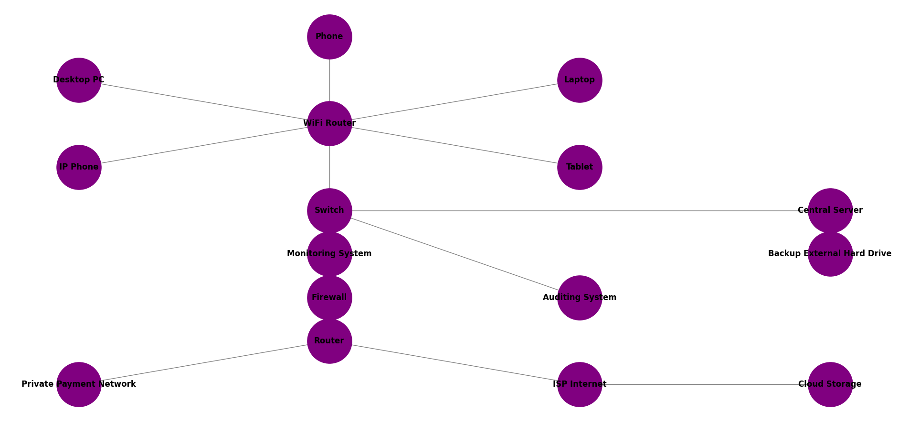

# Network Topology recommendations

Given the following network topology:

The security architecture could be improved by the following [recommendations](https://docs.google.com/document/d/1QZ5IrlDdAU-tQxKOkgTJ5YVFDGuhfnbxA8U2Jbg5Nvk) (Google Document link).

Notworthy changes documented in the recommended topology diagram.

### Segment the Network Using VLANs
* Implement VLANs: Segregate different types of traffic (e.g., employee devices, IP phones, servers) into separate VLANs. This will limit the broadcast domain and reduce the risk of broadcast storms and attacks spreading across the entire network.
* Secure VLAN Configuration: Ensure proper configuration to avoid VLAN hopping attacks.

### Network Monitoring and Logging
* Continuous Monitoring: Implement network monitoring tools to continuously monitor network traffic and identify anomalies.
* Centralized Logging: Use a centralized logging system to collect and analyze logs from all network devices, aiding in incident response and forensic investigations.

# Running the code

1. Install dependencies with `pip install -r requirements.txt`
2. Run with `python3 full_scale_mapping_update.py`
3. If it runs successfully you will see a new window that shows the network topology diagram: 

